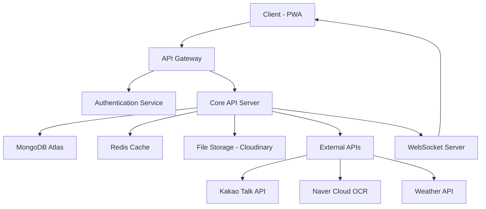
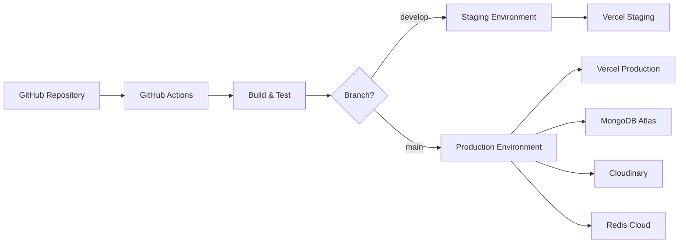

# KidsManager 상세 개발 PRD (Product Requirements Document)

> **하루 10분으로 완성하는 우리 아이 성장 통합 관리 플랫폼**  
> **개발팀을 위한 기술 중심 요구사항 명세서**

---

## 📋 목차

1. [Executive Summary](#1-executive-summary)
2. [Technical Architecture](#2-technical-architecture)
3. [Data Models & Database Schema](#3-data-models--database-schema)
4. [API Specifications](#4-api-specifications)
5. [Security & Privacy Requirements](#5-security--privacy-requirements)
6. [Performance Requirements](#6-performance-requirements)
7. [Development Standards](#7-development-standards)
8. [Detailed Implementation Plan](#8-detailed-implementation-plan)
9. [Testing Strategy](#9-testing-strategy)
10. [Deployment & DevOps](#10-deployment--devops)
11. [Monitoring & Analytics](#11-monitoring--analytics)
12. [Risk Management](#12-risk-management)

---

## 1. Executive Summary

### 1.1 프로젝트 개요
**KidsManager**는 초등학생 자녀를 둔 부모를 위한 통합 관리 플랫폼으로, 학습, 학교생활, 건강 관리를 하나의 플랫폼에서 효율적으로 관리할 수 있는 PWA(Progressive Web App)입니다.

### 1.2 핵심 비즈니스 목표
- 부모의 일일 자녀 관리 시간을 **10-15분 이내**로 단축
- **자동화**를 통한 효율적인 관리 시스템 구축
- AI 기반 **개인화된 인사이트** 제공
- 단일 플랫폼에서의 **통합 관리** 실현

### 1.3 타겟 사용자
- **1차 타겟**: 초등학생(4-6학년) 자녀를 둔 30-40대 부모
- **특성**: 맞벌이 가정, 디지털 기기 활용 익숙, 체계적 자녀 교육 관심

### 1.4 기술 스택 개요
```
Frontend: React 18 + TypeScript + PWA + Tailwind CSS
Backend: Node.js + Express + TypeScript + MongoDB
Deployment: Vercel + MongoDB Atlas + Cloudinary
External APIs: Kakao, Naver Cloud OCR, Weather API
```

---

## 2. Technical Architecture

### 2.1 시스템 아키텍처



### 2.2 Frontend Architecture

#### 2.2.1 프로젝트 구조
```
frontend/
├── public/
│   ├── manifest.json          # PWA 설정
│   └── sw.js                  # Service Worker
├── src/
│   ├── components/            # 재사용 컴포넌트
│   │   ├── common/           # 공통 컴포넌트
│   │   ├── forms/            # 폼 컴포넌트
│   │   └── charts/           # 차트 컴포넌트
│   ├── pages/                # 페이지 컴포넌트
│   │   ├── auth/             # 인증 관련
│   │   ├── dashboard/        # 대시보드
│   │   ├── study/            # 학습 관리
│   │   ├── school/           # 학교생활
│   │   └── health/           # 건강 관리
│   ├── hooks/                # Custom Hooks
│   ├── store/                # Redux Store
│   │   ├── slices/           # Redux Slices
│   │   └── api/              # RTK Query APIs
│   ├── utils/                # 유틸리티 함수
│   ├── types/                # TypeScript 타입
│   └── constants/            # 상수 정의
```

#### 2.2.2 상태 관리
- **전역 상태**: Redux Toolkit + RTK Query
- **로컬 상태**: React useState/useReducer
- **서버 상태**: RTK Query (캐싱, 동기화)
- **폼 상태**: React Hook Form

#### 2.2.3 PWA 설정
```json
{
  "name": "KidsManager",
  "short_name": "키즈매니저",
  "theme_color": "#4F46E5",
  "background_color": "#FFFFFF",
  "display": "standalone",
  "start_url": "/",
  "icons": [
    {
      "src": "/icon-192.png",
      "sizes": "192x192",
      "type": "image/png"
    }
  ]
}
```

### 2.3 Backend Architecture

#### 2.3.1 프로젝트 구조
```
backend/
├── src/
│   ├── controllers/          # 컨트롤러
│   │   ├── auth.controller.ts
│   │   ├── user.controller.ts
│   │   ├── study.controller.ts
│   │   ├── school.controller.ts
│   │   └── health.controller.ts
│   ├── services/             # 비즈니스 로직
│   ├── models/               # MongoDB 모델
│   ├── middleware/           # 미들웨어
│   ├── routes/               # 라우팅
│   ├── utils/                # 유틸리티
│   ├── types/                # TypeScript 타입
│   └── config/               # 설정
├── tests/                    # 테스트 파일
└── docs/                     # API 문서
```

#### 2.3.2 레이어드 아키텍처
```
┌─────────────────┐
│   Controllers   │ ← HTTP 요청/응답 처리
├─────────────────┤
│    Services     │ ← 비즈니스 로직
├─────────────────┤
│   Repositories  │ ← 데이터 접근 계층
├─────────────────┤
│     Models      │ ← 데이터 모델
└─────────────────┘
```

### 2.4 데이터베이스 설계

#### 2.4.1 MongoDB 컬렉션 구조
```
kidsmanager/
├── users              # 사용자 (부모)
├── children           # 자녀 정보
├── study_records      # 학습 기록
├── school_schedules   # 학교 일정
├── health_records     # 건강 기록
├── notifications      # 알림
└── settings           # 설정
```

---

## 3. Data Models & Database Schema

### 3.1 User Schema (사용자)

```typescript
interface User {
  _id: ObjectId;
  email: string;
  name: string;
  provider: 'kakao' | 'google' | 'email';
  providerId?: string;
  profileImage?: string;
  children: ObjectId[];
  settings: {
    notifications: {
      email: boolean;
      kakao: boolean;
      push: boolean;
    };
    timezone: string;
  };
  createdAt: Date;
  updatedAt: Date;
  lastLoginAt?: Date;
}
```

### 3.2 Child Schema (자녀)

```typescript
interface Child {
  _id: ObjectId;
  parent: ObjectId;
  name: string;
  birthDate: Date;
  grade: number;
  school: string;
  profileImage?: string;
  
  // 기본 정보
  gender: 'male' | 'female';
  bloodType?: string;
  allergies?: string[];
  
  // 학습 관련
  subjects: string[];
  studyGoals: {
    subject: string;
    targetScore: number;
    currentScore?: number;
  }[];
  
  // 건강 관련
  healthMetrics: {
    height?: number;
    weight?: number;
    lastMeasured?: Date;
  };
  
  createdAt: Date;
  updatedAt: Date;
  isActive: boolean;
}
```

### 3.3 Study Record Schema (학습 기록)

```typescript
interface StudyRecord {
  _id: ObjectId;
  child: ObjectId;
  date: Date;
  
  // 성적 관리
  scores?: {
    subject: string;
    score: number;
    maxScore: number;
    examType: 'quiz' | 'midterm' | 'final' | 'assignment';
    date: Date;
  }[];
  
  // 숙제 관리
  homework?: {
    subject: string;
    title: string;
    description?: string;
    dueDate: Date;
    isCompleted: boolean;
    completedAt?: Date;
  }[];
  
  // 학습 시간
  studyTime?: {
    subject: string;
    duration: number; // minutes
    focusLevel: 1 | 2 | 3; // 1: low, 2: medium, 3: high
  }[];
  
  createdAt: Date;
  updatedAt: Date;
}
```

### 3.4 School Schedule Schema (학교 일정)

```typescript
interface SchoolSchedule {
  _id: ObjectId;
  child: ObjectId;
  
  // 시간표
  timetable: {
    [key: string]: { // 'monday', 'tuesday', etc.
      periods: {
        period: number;
        subject: string;
        teacher?: string;
        classroom?: string;
      }[];
    };
  };
  
  // 준비물
  preparations: {
    date: Date;
    items: string[];
    isCompleted: boolean;
  }[];
  
  // 학교 행사
  events: {
    title: string;
    date: Date;
    type: 'exam' | 'event' | 'holiday' | 'meeting';
    description?: string;
    isImportant: boolean;
  }[];
  
  // 교사 소통
  communications: {
    date: Date;
    teacher: string;
    content: string;
    type: 'meeting' | 'phone' | 'note';
    attachments?: string[];
  }[];
  
  semester: string; // '2024-1', '2024-2'
  createdAt: Date;
  updatedAt: Date;
}
```

### 3.5 Health Record Schema (건강 기록)

```typescript
interface HealthRecord {
  _id: ObjectId;
  child: ObjectId;
  date: Date;
  
  // 성장 기록
  growth?: {
    height: number;
    weight: number;
    measuredAt: Date;
  };
  
  // 수면 패턴
  sleep?: {
    bedTime: Date;
    wakeTime: Date;
    quality: 1 | 2 | 3 | 4 | 5;
  };
  
  // 컨디션
  condition?: {
    mood: 1 | 2 | 3 | 4 | 5; // 1: very sad, 5: very happy
    energy: 1 | 2 | 3 | 4 | 5;
    appetite: 1 | 2 | 3 | 4 | 5;
    notes?: string;
  };
  
  // 운동량
  exercise?: {
    type: string;
    duration: number; // minutes
    intensity: 'low' | 'medium' | 'high';
  }[];
  
  createdAt: Date;
  updatedAt: Date;
}
```

### 3.6 Notification Schema (알림)

```typescript
interface Notification {
  _id: ObjectId;
  user: ObjectId;
  child?: ObjectId;
  
  type: 'homework' | 'exam' | 'preparation' | 'health' | 'achievement';
  title: string;
  message: string;
  
  // 알림 채널
  channels: {
    push: boolean;
    email: boolean;
    kakao: boolean;
  };
  
  // 스케줄링
  scheduledAt: Date;
  sentAt?: Date;
  isRead: boolean;
  
  // 액션
  actionUrl?: string;
  actionText?: string;
  
  createdAt: Date;
  expiresAt?: Date;
}
```

---

## 4. API Specifications

### 4.1 API 구조 및 규칙

#### 4.1.1 Base URL
```
Production: https://api.kidsmanager.com/v1
Development: http://localhost:3001/api/v1
```

#### 4.1.2 API 규칙
- **RESTful 설계 원칙** 준수
- **HTTP Status Code** 표준 사용
- **JSON** 형식 데이터 교환
- **JWT Token** 기반 인증
- **Rate Limiting**: 1000 requests/hour per user

#### 4.1.3 공통 응답 형식
```typescript
interface ApiResponse<T> {
  success: boolean;
  data?: T;
  error?: {
    code: string;
    message: string;
    details?: any;
  };
  meta?: {
    pagination?: {
      page: number;
      limit: number;
      total: number;
      totalPages: number;
    };
  };
}
```

### 4.2 Authentication APIs

#### 4.2.1 소셜 로그인
```http
POST /auth/kakao
Content-Type: application/json

{
  "code": "authorization_code_from_kakao"
}

Response:
{
  "success": true,
  "data": {
    "user": {
      "id": "user_id",
      "email": "user@example.com",
      "name": "홍길동",
      "profileImage": "image_url"
    },
    "tokens": {
      "accessToken": "jwt_access_token",
      "refreshToken": "jwt_refresh_token"
    }
  }
}
```

#### 4.2.2 토큰 갱신
```http
POST /auth/refresh
Authorization: Bearer {refresh_token}

Response:
{
  "success": true,
  "data": {
    "accessToken": "new_jwt_access_token"
  }
}
```

### 4.3 User Management APIs

#### 4.3.1 사용자 정보 조회
```http
GET /users/me
Authorization: Bearer {access_token}

Response:
{
  "success": true,
  "data": {
    "id": "user_id",
    "email": "user@example.com",
    "name": "홍길동",
    "children": [
      {
        "id": "child_id",
        "name": "홍둘리",
        "grade": 6,
        "school": "서울초등학교"
      }
    ],
    "settings": {
      "notifications": {
        "email": true,
        "kakao": true,
        "push": true
      }
    }
  }
}
```

#### 4.3.2 자녀 등록
```http
POST /children
Authorization: Bearer {access_token}
Content-Type: application/json

{
  "name": "홍둘리",
  "birthDate": "2012-05-15",
  "grade": 6,
  "school": "서울초등학교",
  "subjects": ["국어", "수학", "영어", "과학", "사회"]
}

Response:
{
  "success": true,
  "data": {
    "id": "child_id",
    "name": "홍둘리",
    "grade": 6,
    "school": "서울초등학교"
  }
}
```

### 4.4 Study Management APIs

#### 4.4.1 성적 입력
```http
POST /study/scores
Authorization: Bearer {access_token}
Content-Type: application/json

{
  "childId": "child_id",
  "scores": [
    {
      "subject": "수학",
      "score": 85,
      "maxScore": 100,
      "examType": "midterm",
      "date": "2024-03-15"
    }
  ]
}
```

#### 4.4.2 OCR 성적 인식
```http
POST /study/scores/ocr
Authorization: Bearer {access_token}
Content-Type: multipart/form-data

{
  "childId": "child_id",
  "image": file,
  "examType": "midterm"
}

Response:
{
  "success": true,
  "data": {
    "recognizedScores": [
      {
        "subject": "수학",
        "score": 85,
        "confidence": 0.95
      }
    ],
    "imageUrl": "processed_image_url"
  }
}
```

#### 4.4.3 숙제 관리
```http
POST /study/homework
Authorization: Bearer {access_token}
Content-Type: application/json

{
  "childId": "child_id",
  "subject": "수학",
  "title": "문제집 3단원",
  "dueDate": "2024-03-20",
  "description": "3단원 연습문제 1-20번"
}
```

### 4.5 School Management APIs

#### 4.5.1 시간표 등록
```http
POST /school/timetable
Authorization: Bearer {access_token}
Content-Type: application/json

{
  "childId": "child_id",
  "semester": "2024-1",
  "timetable": {
    "monday": {
      "periods": [
        {"period": 1, "subject": "국어", "teacher": "김선생님"},
        {"period": 2, "subject": "수학", "teacher": "이선생님"}
      ]
    }
  }
}
```

#### 4.5.2 준비물 체크리스트 조회
```http
GET /school/preparations?childId=child_id&date=2024-03-20
Authorization: Bearer {access_token}

Response:
{
  "success": true,
  "data": {
    "date": "2024-03-20",
    "items": [
      {
        "item": "미술 도구",
        "reason": "미술 시간",
        "isCompleted": false
      },
      {
        "item": "체육복",
        "reason": "체육 시간",
        "isCompleted": true
      }
    ],
    "weather": {
      "condition": "rainy",
      "recommendation": "우산 필요"
    }
  }
}
```

### 4.6 Health Management APIs

#### 4.6.1 성장 기록 입력
```http
POST /health/growth
Authorization: Bearer {access_token}
Content-Type: application/json

{
  "childId": "child_id",
  "height": 145.5,
  "weight": 38.2,
  "measuredAt": "2024-03-15T09:00:00Z"
}
```

#### 4.6.2 수면 패턴 입력
```http
POST /health/sleep
Authorization: Bearer {access_token}
Content-Type: application/json

{
  "childId": "child_id",
  "date": "2024-03-15",
  "bedTime": "2024-03-15T21:30:00Z",
  "wakeTime": "2024-03-16T07:00:00Z",
  "quality": 4
}
```

### 4.7 Analytics APIs

#### 4.7.1 대시보드 데이터
```http
GET /analytics/dashboard?childId=child_id
Authorization: Bearer {access_token}

Response:
{
  "success": true,
  "data": {
    "summary": {
      "todayTasks": 5,
      "completedTasks": 3,
      "upcomingExams": 2,
      "healthScore": 85
    },
    "recentScores": [
      {"subject": "수학", "score": 85, "date": "2024-03-15"},
      {"subject": "국어", "score": 92, "date": "2024-03-10"}
    ],
    "weeklyPattern": {
      "studyTime": [120, 90, 150, 100, 110, 180, 60],
      "sleepHours": [9.5, 8.5, 9, 8, 9, 10, 10.5]
    }
  }
}
```

#### 4.7.2 주간 리포트
```http
GET /analytics/weekly-report?childId=child_id&week=2024-W12
Authorization: Bearer {access_token}

Response:
{
  "success": true,
  "data": {
    "period": "2024-03-18 ~ 2024-03-24",
    "study": {
      "totalHours": 12.5,
      "averageScore": 87.5,
      "improvementSubjects": ["수학"],
      "concernSubjects": ["영어"]
    },
    "health": {
      "averageSleep": 9.2,
      "exerciseTime": 240,
      "moodAverage": 4.2
    },
    "achievements": [
      "수학 성적 10점 향상",
      "숙제 완료율 100% 달성"
    ],
    "recommendations": [
      "영어 단어 암기 시간 늘리기",
      "취침 시간 30분 앞당기기"
    ]
  }
}
```

### 4.8 WebSocket Events

#### 4.8.1 실시간 알림
```typescript
// Client -> Server
interface JoinRoomEvent {
  type: 'join_room';
  userId: string;
}

// Server -> Client
interface NotificationEvent {
  type: 'notification';
  data: {
    id: string;
    title: string;
    message: string;
    type: string;
    createdAt: string;
  };
}

interface UpdateEvent {
  type: 'data_update';
  data: {
    entity: string; // 'homework', 'schedule', etc.
    action: 'create' | 'update' | 'delete';
    id: string;
  };
}
```

---

## 5. Security & Privacy Requirements

### 5.1 인증 및 권한 관리

#### 5.1.1 JWT 토큰 전략
```typescript
interface JWTPayload {
  userId: string;
  email: string;
  role: 'parent';
  iat: number;
  exp: number;
}

// Access Token: 1시간
// Refresh Token: 30일
// Token Rotation: 사용 시마다 새로운 토큰 발급
```

#### 5.1.2 권한 관리
```typescript
enum Permission {
  READ_CHILD_DATA = 'read:child_data',
  WRITE_CHILD_DATA = 'write:child_data',
  MANAGE_CHILD = 'manage:child',
  VIEW_ANALYTICS = 'view:analytics'
}

// 부모는 자신의 자녀 데이터만 접근 가능
// 자녀별 권한 분리
```

### 5.2 데이터 보호

#### 5.2.1 개인정보보호법 준수
- **아동 개인정보보호**: 만 14세 미만 법정대리인 동의 필수
- **최소 수집 원칙**: 서비스 제공에 필요한 최소한의 정보만 수집
- **목적 제한**: 수집 목적 외 사용 금지
- **보관 기간**: 서비스 탈퇴 후 즉시 삭제 (법적 보관 의무 제외)

#### 5.2.2 데이터 암호화
```typescript
// 저장 시 암호화 대상
const SENSITIVE_FIELDS = [
  'child.name',
  'user.email',
  'health.records',
  'school.communications'
];

// AES-256-GCM 암호화
// 개인키는 환경변수로 관리
// 데이터베이스 레벨 암호화 추가
```

#### 5.2.3 API 보안
```typescript
// Rate Limiting
const rateLimits = {
  '/api/auth/*': '10 requests per 15 minutes',
  '/api/*': '1000 requests per hour',
  '/api/upload/*': '50 requests per hour'
};

// Input Validation
const validationRules = {
  childName: /^[가-힣a-zA-Z\s]{1,20}$/,
  score: (value: number) => value >= 0 && value <= 100,
  email: (email: string) => emailRegex.test(email)
};

// XSS Protection
app.use(helmet());
app.use(express.json({ limit: '10mb' }));
```

### 5.3 HTTPS 및 보안 헤더
```typescript
// Security Headers
const securityHeaders = {
  'Strict-Transport-Security': 'max-age=31536000; includeSubDomains',
  'X-Content-Type-Options': 'nosniff',
  'X-Frame-Options': 'DENY',
  'X-XSS-Protection': '1; mode=block',
  'Content-Security-Policy': `
    default-src 'self';
    script-src 'self' 'unsafe-inline' https://developers.kakao.com;
    style-src 'self' 'unsafe-inline';
    img-src 'self' data: https:;
  `
};
```

---

## 6. Performance Requirements

### 6.1 응답 시간 목표

| 기능 | 목표 시간 | 최대 허용 시간 |
|------|-----------|----------------|
| 페이지 초기 로딩 | 2초 | 3초 |
| API 응답 | 500ms | 1초 |
| 이미지 업로드 | 3초 | 5초 |
| OCR 처리 | 5초 | 10초 |
| 리포트 생성 | 2초 | 3초 |

### 6.2 확장성 목표

| 지표 | 초기 목표 | 6개월 목표 | 1년 목표 |
|------|-----------|------------|----------|
| 동시 사용자 | 100명 | 1,000명 | 10,000명 |
| 데이터 크기 | 1GB | 100GB | 1TB |
| API 요청 | 1,000/분 | 10,000/분 | 100,000/분 |

### 6.3 최적화 전략

#### 6.3.1 Frontend 최적화
```typescript
// Code Splitting
const Dashboard = lazy(() => import('./pages/Dashboard'));
const StudyManagement = lazy(() => import('./pages/StudyManagement'));

// Image Optimization
const optimizedImageSizes = [200, 400, 800, 1200];
const imageFormats = ['webp', 'jpg'];

// Caching Strategy
const cacheConfig = {
  'static-assets': '1 year',
  'api-data': '5 minutes',
  'user-data': '1 minute'
};
```

#### 6.3.2 Backend 최적화
```typescript
// Database Indexing
const indexes = {
  users: ['email', 'providerId'],
  children: ['parent', 'name'],
  studyRecords: ['child', 'date'],
  healthRecords: ['child', 'date'],
  notifications: ['user', 'scheduledAt']
};

// Query Optimization
const aggregationPipelines = {
  weeklyReport: [
    { $match: { child: childId, date: { $gte: startDate, $lte: endDate } } },
    { $group: { _id: '$subject', avgScore: { $avg: '$score' } } },
    { $sort: { avgScore: -1 } }
  ]
};
```

#### 6.3.3 캐싱 전략
```typescript
// Redis Caching
const cacheStrategy = {
  userSession: { ttl: 3600 }, // 1 hour
  childData: { ttl: 1800 },   // 30 minutes
  analytics: { ttl: 3600 },   // 1 hour
  timetable: { ttl: 86400 }   // 24 hours
};

// CDN Configuration
const cdnConfig = {
  staticAssets: 'https://cdn.kidsmanager.com',
  images: 'https://images.kidsmanager.com',
  regions: ['seoul', 'tokyo', 'singapore']
};
```

---

## 7. Development Standards

### 7.1 코딩 표준

#### 7.1.1 TypeScript 설정
```json
{
  "compilerOptions": {
    "strict": true,
    "noImplicitAny": true,
    "noImplicitReturns": true,
    "noUnusedLocals": true,
    "noUnusedParameters": true,
    "exactOptionalPropertyTypes": true
  }
}
```

#### 7.1.2 ESLint 규칙
```json
{
  "extends": [
    "@typescript-eslint/recommended",
    "prettier"
  ],
  "rules": {
    "no-console": "warn",
    "prefer-const": "error",
    "@typescript-eslint/no-unused-vars": "error",
    "@typescript-eslint/explicit-function-return-type": "warn"
  }
}
```

#### 7.1.3 Prettier 설정
```json
{
  "semi": true,
  "trailingComma": "es5",
  "singleQuote": true,
  "printWidth": 80,
  "tabWidth": 2
}
```

### 7.2 Git 워크플로우

#### 7.2.1 브랜치 전략
```
main           ← 프로덕션 배포
├── develop    ← 개발 통합
│   ├── feature/auth-system
│   ├── feature/study-management
│   └── feature/health-tracking
├── release/v1.0.0
└── hotfix/critical-bug-fix
```

#### 7.2.2 커밋 메시지 규칙
```
type(scope): subject

feat(auth): add kakao social login
fix(api): resolve score calculation error
docs(readme): update installation guide
test(study): add unit tests for score service
refactor(components): extract common form components
```

#### 7.2.3 Pull Request 템플릿
```markdown
## 변경사항
- [ ] 기능 추가/수정
- [ ] 버그 수정
- [ ] 문서 업데이트
- [ ] 코드 리팩토링

## 테스트
- [ ] 단위 테스트 통과
- [ ] 통합 테스트 통과
- [ ] E2E 테스트 통과

## 체크리스트
- [ ] 코드 리뷰 완료
- [ ] TypeScript 컴파일 통과
- [ ] ESLint 검사 통과
- [ ] 보안 검토 완료
```

### 7.3 코드 리뷰 가이드라인

#### 7.3.1 리뷰 포인트
1. **기능성**: 요구사항 충족 여부
2. **보안성**: 취약점 검토
3. **성능**: 효율성 및 최적화
4. **가독성**: 코드 이해도
5. **테스트**: 테스트 커버리지

#### 7.3.2 리뷰 프로세스
```
1. 개발자 셀프 리뷰
2. 동료 개발자 리뷰 (최소 1명)
3. 시니어 개발자 승인
4. 자동화 테스트 통과
5. Merge 승인
```

---

## 8. Detailed Implementation Plan

### 8.1 Phase 1: MVP Development (12주)

#### Week 1-2: 프로젝트 초기 설정
**목표**: 개발 환경 구성 및 기본 인프라 구축

**Frontend 설정**:
```bash
# 프로젝트 생성
npx create-react-app frontend --template typescript
cd frontend

# 필수 라이브러리 설치
npm install @reduxjs/toolkit react-redux
npm install react-router-dom
npm install @tailwindcss/forms
npm install react-hook-form
npm install @headlessui/react
npm install chart.js react-chartjs-2
npm install react-query

# 개발 도구
npm install -D eslint prettier husky lint-staged
```

**Backend 설정**:
```bash
# 프로젝트 생성
mkdir backend && cd backend
npm init -y

# 필수 라이브러리 설치
npm install express mongoose cors helmet
npm install jsonwebtoken bcryptjs
npm install multer cloudinary
npm install socket.io
npm install redis
npm install @types/node typescript ts-node

# 개발 도구
npm install -D nodemon jest supertest
npm install -D @types/express @types/jsonwebtoken
```

**환경 설정**:
```typescript
// Docker Compose 설정
version: '3.8'
services:
  mongodb:
    image: mongo:latest
    ports:
      - "27017:27017"
  redis:
    image: redis:alpine
    ports:
      - "6379:6379"
  app:
    build: .
    ports:
      - "3001:3001"
    depends_on:
      - mongodb
      - redis
```

**완료 기준**:
- [ ] Frontend/Backend 프로젝트 구조 완성
- [ ] TypeScript 설정 완료
- [ ] ESLint/Prettier 설정 완료
- [ ] Docker 개발 환경 구성
- [ ] Git 저장소 설정 및 기본 브랜치 전략 구성

#### Week 3-4: 인증 시스템 구현
**목표**: 사용자 인증 및 권한 관리 시스템 구축

**구현 항목**:
1. **소셜 로그인 (카카오/구글)**
```typescript
// backend/src/services/auth.service.ts
export class AuthService {
  async kakaoLogin(code: string): Promise<AuthResult> {
    // 카카오 토큰 교환
    const kakaoToken = await this.exchangeKakaoCode(code);
    
    // 카카오 사용자 정보 조회
    const kakaoUser = await this.getKakaoUserInfo(kakaoToken);
    
    // 사용자 생성 또는 업데이트
    const user = await this.findOrCreateUser(kakaoUser);
    
    // JWT 토큰 생성
    return this.generateTokens(user);
  }
}
```

2. **JWT 토큰 관리**
```typescript
// backend/src/middleware/auth.middleware.ts
export const authenticateToken = (req: Request, res: Response, next: NextFunction) => {
  const token = req.headers.authorization?.split(' ')[1];
  
  if (!token) {
    return res.status(401).json({ error: 'Access token required' });
  }
  
  try {
    const decoded = jwt.verify(token, process.env.JWT_SECRET!) as JWTPayload;
    req.user = decoded;
    next();
  } catch (error) {
    res.status(403).json({ error: 'Invalid token' });
  }
};
```

3. **Frontend 인증 상태 관리**
```typescript
// frontend/src/store/slices/authSlice.ts
export const authSlice = createSlice({
  name: 'auth',
  initialState: {
    user: null,
    isAuthenticated: false,
    loading: false
  },
  reducers: {
    loginStart: (state) => {
      state.loading = true;
    },
    loginSuccess: (state, action) => {
      state.user = action.payload.user;
      state.isAuthenticated = true;
      state.loading = false;
    },
    logout: (state) => {
      state.user = null;
      state.isAuthenticated = false;
      state.loading = false;
    }
  }
});
```

**완료 기준**:
- [ ] 카카오/구글 소셜 로그인 구현
- [ ] JWT 토큰 발급/갱신 시스템
- [ ] 인증 미들웨어 구현
- [ ] 보호된 라우트 구현
- [ ] 로그인/로그아웃 UI 구현

#### Week 5-7: 학습 관리 모듈
**목표**: 성적 입력, 숙제 관리, 학습 시간 기록 기능 구현

**구현 항목**:
1. **성적 입력 시스템**
```typescript
// backend/src/controllers/study.controller.ts
export class StudyController {
  async addScore(req: Request, res: Response): Promise<void> {
    const { childId, subject, score, maxScore, examType } = req.body;
    
    // 권한 검증 (해당 자녀의 부모인지 확인)
    await this.verifyChildAccess(req.user.userId, childId);
    
    // 성적 데이터 저장
    const studyRecord = await StudyRecord.create({
      child: childId,
      scores: [{ subject, score, maxScore, examType, date: new Date() }]
    });
    
    // 실시간 업데이트 알림
    this.socketService.emitToUser(req.user.userId, 'score_updated', studyRecord);
    
    res.json({ success: true, data: studyRecord });
  }
}
```

2. **OCR 연동**
```typescript
// backend/src/services/ocr.service.ts
export class OCRService {
  async recognizeScoreSheet(imageBuffer: Buffer): Promise<RecognizedScore[]> {
    // Naver Clova OCR API 호출
    const ocrResult = await this.naverOCR.recognize(imageBuffer);
    
    // 성적표 패턴 분석
    const scores = this.parseScorePattern(ocrResult.text);
    
    return scores.map(score => ({
      subject: score.subject,
      score: score.score,
      confidence: score.confidence
    }));
  }
  
  private parseScorePattern(text: string): ParsedScore[] {
    // 성적표 텍스트 패턴 분석 로직
    const patterns = [
      /국어[\s:]*(\d+)/g,
      /수학[\s:]*(\d+)/g,
      /영어[\s:]*(\d+)/g,
      /과학[\s:]*(\d+)/g,
      /사회[\s:]*(\d+)/g
    ];
    
    return patterns.map(pattern => {
      const match = text.match(pattern);
      return match ? this.extractScore(match[0]) : null;
    }).filter(Boolean);
  }
}
```

3. **숙제 관리 시스템**
```typescript
// frontend/src/components/HomeworkManager.tsx
export const HomeworkManager: React.FC = () => {
  const [homework, setHomework] = useState<Homework[]>([]);
  const { mutate: addHomework } = useAddHomeworkMutation();
  
  const handleAddHomework = (data: HomeworkForm) => {
    addHomework({
      childId: selectedChild.id,
      ...data
    }, {
      onSuccess: () => {
        // 성공 알림
        toast.success('숙제가 등록되었습니다');
        // 자동 알림 설정
        scheduleNotification(data.dueDate);
      }
    });
  };
  
  return (
    <div className="space-y-4">
      <HomeworkForm onSubmit={handleAddHomework} />
      <HomeworkList homework={homework} />
    </div>
  );
};
```

**완료 기준**:
- [ ] 성적 입력/조회 API 구현
- [ ] OCR 성적표 인식 기능
- [ ] 숙제 CRUD 기능
- [ ] 학습 시간 기록 기능
- [ ] 성적 추이 차트 구현

#### Week 8-9: 학교생활 모듈
**목표**: 시간표, 준비물, 학교 일정 관리 기능 구현

**구현 항목**:
1. **시간표 관리**
```typescript
// backend/src/models/Schedule.model.ts
const scheduleSchema = new Schema({
  child: { type: ObjectId, ref: 'Child', required: true },
  semester: { type: String, required: true },
  timetable: {
    monday: [{ period: Number, subject: String, teacher: String }],
    tuesday: [{ period: Number, subject: String, teacher: String }],
    // ... 다른 요일들
  },
  createdAt: { type: Date, default: Date.now }
});
```

2. **자동 준비물 생성**
```typescript
// backend/src/services/preparation.service.ts
export class PreparationService {
  async generateDailyPreparations(childId: string, date: Date): Promise<Preparation[]> {
    // 해당 날짜의 시간표 조회
    const schedule = await this.getScheduleByDate(childId, date);
    
    // 과목별 준비물 매핑
    const subjectPreparations = this.getPreparationsBySubjects(schedule.subjects);
    
    // 날씨 정보 가져오기
    const weather = await this.weatherService.getWeather(date);
    
    // 날씨 기반 추가 준비물
    const weatherPreparations = this.getWeatherBasedPreparations(weather);
    
    return [...subjectPreparations, ...weatherPreparations];
  }
  
  private getPreparationsBySubjects(subjects: string[]): Preparation[] {
    const preparationMap = {
      '체육': ['체육복', '운동화'],
      '미술': ['미술 도구', '앞치마'],
      '음악': ['리코더', '악보'],
      '과학': ['실험 도구', '관찰 일지']
    };
    
    return subjects.flatMap(subject => 
      preparationMap[subject]?.map(item => ({
        item,
        reason: `${subject} 시간`,
        isCompleted: false
      })) || []
    );
  }
}
```

**완료 기준**:
- [ ] 시간표 등록/수정 기능
- [ ] 자동 준비물 생성 로직
- [ ] 날씨 연동 준비물 추천
- [ ] 학교 일정 캘린더 뷰

#### Week 10-11: 건강 관리 모듈
**목표**: 성장 기록, 수면 패턴, 컨디션 체크 기능 구현

**구현 항목**:
1. **성장 차트**
```typescript
// frontend/src/components/GrowthChart.tsx
export const GrowthChart: React.FC<{ childId: string }> = ({ childId }) => {
  const { data: growthData } = useGrowthDataQuery(childId);
  
  const chartData = {
    labels: growthData?.map(record => format(record.date, 'MM/dd')),
    datasets: [
      {
        label: '키 (cm)',
        data: growthData?.map(record => record.height),
        borderColor: 'rgb(75, 192, 192)',
        tension: 0.1
      },
      {
        label: '몸무게 (kg)',
        data: growthData?.map(record => record.weight),
        borderColor: 'rgb(255, 99, 132)',
        tension: 0.1
      }
    ]
  };
  
  return (
    <div className="bg-white p-6 rounded-lg shadow">
      <h3 className="text-lg font-semibold mb-4">성장 추이</h3>
      <Line data={chartData} options={chartOptions} />
    </div>
  );
};
```

2. **수면 패턴 분석**
```typescript
// backend/src/services/health.service.ts
export class HealthService {
  async analyzeSleepPattern(childId: string, period: number = 30): Promise<SleepAnalysis> {
    const sleepRecords = await HealthRecord.find({
      child: childId,
      date: { $gte: new Date(Date.now() - period * 24 * 60 * 60 * 1000) }
    });
    
    const analysis = {
      averageSleepDuration: this.calculateAverageSleep(sleepRecords),
      sleepQualityTrend: this.analyzeSleepQuality(sleepRecords),
      recommendations: this.generateSleepRecommendations(sleepRecords)
    };
    
    return analysis;
  }
  
  private generateSleepRecommendations(records: HealthRecord[]): string[] {
    const recommendations = [];
    const avgBedtime = this.calculateAverageBedtime(records);
    
    if (avgBedtime > 22) { // 10시 이후
      recommendations.push('취침 시간을 30분 앞당겨보세요');
    }
    
    const sleepVariability = this.calculateSleepVariability(records);
    if (sleepVariability > 1) { // 1시간 이상 차이
      recommendations.push('규칙적인 수면 패턴을 유지해보세요');
    }
    
    return recommendations;
  }
}
```

**완료 기준**:
- [ ] 성장 기록 입력/차트 구현
- [ ] 수면 패턴 분석 알고리즘
- [ ] 컨디션 체크 UI
- [ ] 건강 인사이트 제공

#### Week 12: 통합 테스트 및 배포
**목표**: 전체 시스템 통합 테스트 및 프로덕션 배포

**구현 항목**:
1. **E2E 테스트**
```typescript
// tests/e2e/user-journey.test.ts
describe('User Journey', () => {
  it('should complete full parent workflow', async () => {
    // 1. 회원가입
    await page.goto('/auth/login');
    await page.click('[data-testid="kakao-login"]');
    // 카카오 로그인 모킹
    
    // 2. 자녀 등록
    await page.click('[data-testid="add-child"]');
    await page.fill('[data-testid="child-name"]', '테스트아이');
    await page.selectOption('[data-testid="grade"]', '6');
    await page.click('[data-testid="save-child"]');
    
    // 3. 성적 입력
    await page.click('[data-testid="add-score"]');
    await page.selectOption('[data-testid="subject"]', '수학');
    await page.fill('[data-testid="score"]', '85');
    await page.click('[data-testid="save-score"]');
    
    // 4. 대시보드 확인
    await page.goto('/dashboard');
    await expect(page.locator('[data-testid="recent-score"]')).toContainText('85');
  });
});
```

2. **성능 테스트**
```typescript
// tests/performance/load.test.ts
import { check } from 'k6';
import http from 'k6/http';

export let options = {
  stages: [
    { duration: '2m', target: 100 }, // 100 users
    { duration: '5m', target: 100 },
    { duration: '2m', target: 200 }, // 200 users
    { duration: '5m', target: 200 },
    { duration: '2m', target: 0 },
  ],
};

export default function () {
  const response = http.get('https://api.kidsmanager.com/v1/dashboard');
  check(response, {
    'status is 200': (r) => r.status === 200,
    'response time < 500ms': (r) => r.timings.duration < 500,
  });
}
```

**완료 기준**:
- [ ] 단위 테스트 커버리지 80% 이상
- [ ] E2E 테스트 주요 시나리오 커버
- [ ] 성능 테스트 통과
- [ ] 보안 스캔 완료
- [ ] 프로덕션 배포 성공

### 8.2 Phase 2: 확장 기능 (추가 12주)

#### Week 13-16: AI 기반 분석 기능
**목표**: 학습 패턴 분석 및 개인화된 추천 시스템 구축

**구현 항목**:
1. **학습 패턴 분석**
```typescript
// backend/src/services/ai-analysis.service.ts
export class AIAnalysisService {
  async analyzeStudyPattern(childId: string): Promise<StudyPatternAnalysis> {
    // 학습 데이터 수집 (최근 3개월)
    const studyData = await this.collectStudyData(childId, 90);
    
    // 패턴 분석
    const patterns = {
      peakStudyHours: this.findPeakStudyHours(studyData),
      subjectPreferences: this.analyzeSubjectPreferences(studyData),
      learningEfficiency: this.calculateLearningEfficiency(studyData),
      improvementTrends: this.identifyImprovementTrends(studyData)
    };
    
    // 개인화된 추천 생성
    const recommendations = this.generatePersonalizedRecommendations(patterns);
    
    return { patterns, recommendations };
  }
  
  private generatePersonalizedRecommendations(patterns: StudyPatterns): Recommendation[] {
    const recommendations = [];
    
    // 취약 과목 분석
    const weakSubjects = patterns.subjectPreferences
      .filter(subject => subject.averageScore < 70)
      .sort((a, b) => a.averageScore - b.averageScore);
    
    if (weakSubjects.length > 0) {
      recommendations.push({
        type: 'study_focus',
        title: `${weakSubjects[0].subject} 집중 학습 권장`,
        description: `${weakSubjects[0].subject} 성적이 다른 과목보다 낮습니다. 주 3회, 30분씩 추가 학습을 권장합니다.`,
        priority: 'high'
      });
    }
    
    // 최적 학습 시간 추천
    if (patterns.peakStudyHours.efficiency > 0.8) {
      recommendations.push({
        type: 'study_timing',
        title: `${patterns.peakStudyHours.hour}시경 학습 효과 최고`,
        description: `분석 결과 ${patterns.peakStudyHours.hour}시 ~ ${patterns.peakStudyHours.hour + 2}시 사이 학습 효율이 가장 높습니다.`,
        priority: 'medium'
      });
    }
    
    return recommendations;
  }
}
```

#### Week 17-20: 외부 API 연동 확장
**목표**: 학교 홈페이지, 교육청, 웨어러블 기기 연동

**구현 항목**:
1. **학교 홈페이지 크롤링**
```typescript
// backend/src/services/school-crawler.service.ts
export class SchoolCrawlerService {
  async crawlSchoolNotices(schoolCode: string): Promise<SchoolNotice[]> {
    try {
      // 교육청 나이스 API 활용
      const response = await axios.get(`https://open.neis.go.kr/hub/SchoolSchedule`, {
        params: {
          KEY: process.env.NEIS_API_KEY,
          Type: 'json',
          ATPT_OFCDC_SC_CODE: schoolCode.substring(0, 3),
          SD_SCHUL_CODE: schoolCode
        }
      });
      
      return response.data.SchoolSchedule[1].row.map(item => ({
        title: item.EVENT_NM,
        date: item.AA_YMD,
        description: item.EVENT_CNTNT
      }));
    } catch (error) {
      console.error('School crawling failed:', error);
      return [];
    }
  }
  
  async getMealInfo(schoolCode: string, date: string): Promise<MealInfo> {
    const response = await axios.get(`https://open.neis.go.kr/hub/mealServiceDietInfo`, {
      params: {
        KEY: process.env.NEIS_API_KEY,
        Type: 'json',
        ATPT_OFCDC_SC_CODE: schoolCode.substring(0, 3),
        SD_SCHUL_CODE: schoolCode,
        MLSV_YMD: date
      }
    });
    
    return {
      breakfast: response.data?.mealServiceDietInfo?.[1]?.row?.[0]?.DDISH_NM || '',
      lunch: response.data?.mealServiceDietInfo?.[1]?.row?.[1]?.DDISH_NM || '',
      dinner: response.data?.mealServiceDietInfo?.[1]?.row?.[2]?.DDISH_NM || ''
    };
  }
}
```

#### Week 21-24: 모바일 앱 전환
**목표**: React Native 기반 네이티브 모바일 앱 개발

**구현 항목**:
1. **React Native 셋업**
```bash
# React Native 프로젝트 생성
npx react-native init KidsManagerMobile --template react-native-template-typescript

# 필수 라이브러리 설치
npm install @react-navigation/native
npm install @react-navigation/stack
npm install react-native-vector-icons
npm install @react-native-async-storage/async-storage
npm install react-native-push-notification
```

**완료 기준**:
- [ ] AI 기반 학습 패턴 분석
- [ ] 개인화된 추천 시스템
- [ ] 외부 API 연동 (교육청, 날씨)
- [ ] 모바일 앱 기본 기능 구현

---

## 9. Testing Strategy

### 9.1 테스트 피라미드

```
                🔺 E2E Tests (10%)
               /   \
              /     \
             🔺 Integration Tests (20%)
            /         \
           /           \
          🔺 Unit Tests (70%)
         /               \
```

### 9.2 단위 테스트 (Unit Tests)

#### 9.2.1 Backend 단위 테스트
```typescript
// tests/unit/services/auth.service.test.ts
describe('AuthService', () => {
  let authService: AuthService;
  let mockUserRepository: jest.Mocked<UserRepository>;
  
  beforeEach(() => {
    mockUserRepository = createMockUserRepository();
    authService = new AuthService(mockUserRepository);
  });
  
  describe('kakaoLogin', () => {
    it('should create new user when kakao user does not exist', async () => {
      // Arrange
      const kakaoCode = 'test-code';
      const kakaoUserInfo = { id: '123', email: 'test@example.com', name: '테스트' };
      
      mockUserRepository.findByProviderId.mockResolvedValue(null);
      mockUserRepository.create.mockResolvedValue(mockUser);
      
      // Act
      const result = await authService.kakaoLogin(kakaoCode);
      
      // Assert
      expect(result.user.email).toBe(kakaoUserInfo.email);
      expect(result.tokens.accessToken).toBeDefined();
      expect(mockUserRepository.create).toHaveBeenCalledWith({
        email: kakaoUserInfo.email,
        name: kakaoUserInfo.name,
        provider: 'kakao',
        providerId: kakaoUserInfo.id
      });
    });
  });
});
```

#### 9.2.2 Frontend 단위 테스트
```typescript
// tests/unit/components/ScoreInput.test.tsx
describe('ScoreInput', () => {
  const mockOnSubmit = jest.fn();
  
  beforeEach(() => {
    mockOnSubmit.mockClear();
  });
  
  it('should validate score input range', async () => {
    render(<ScoreInput onSubmit={mockOnSubmit} />);
    
    const scoreInput = screen.getByLabelText('점수');
    const submitButton = screen.getByRole('button', { name: '저장' });
    
    // 유효하지 않은 점수 입력
    fireEvent.change(scoreInput, { target: { value: '150' } });
    fireEvent.click(submitButton);
    
    await waitFor(() => {
      expect(screen.getByText('점수는 0-100 사이여야 합니다')).toBeInTheDocument();
      expect(mockOnSubmit).not.toHaveBeenCalled();
    });
  });
  
  it('should submit valid score data', async () => {
    render(<ScoreInput onSubmit={mockOnSubmit} />);
    
    fireEvent.change(screen.getByLabelText('과목'), { target: { value: '수학' } });
    fireEvent.change(screen.getByLabelText('점수'), { target: { value: '85' } });
    fireEvent.click(screen.getByRole('button', { name: '저장' }));
    
    await waitFor(() => {
      expect(mockOnSubmit).toHaveBeenCalledWith({
        subject: '수학',
        score: 85,
        examType: 'quiz'
      });
    });
  });
});
```

### 9.3 통합 테스트 (Integration Tests)

#### 9.3.1 API 통합 테스트
```typescript
// tests/integration/api/study.test.ts
describe('Study API Integration', () => {
  let app: Application;
  let authToken: string;
  let testChild: Child;
  
  beforeAll(async () => {
    app = await createTestApp();
    authToken = await getTestAuthToken();
    testChild = await createTestChild();
  });
  
  afterAll(async () => {
    await cleanupTestData();
  });
  
  describe('POST /api/study/scores', () => {
    it('should add score and return updated analytics', async () => {
      const scoreData = {
        childId: testChild.id,
        subject: '수학',
        score: 85,
        maxScore: 100,
        examType: 'midterm'
      };
      
      const response = await request(app)
        .post('/api/study/scores')
        .set('Authorization', `Bearer ${authToken}`)
        .send(scoreData)
        .expect(200);
      
      expect(response.body.success).toBe(true);
      expect(response.body.data.scores[0].score).toBe(85);
      
      // 분석 데이터 업데이트 확인
      const analyticsResponse = await request(app)
        .get(`/api/analytics/dashboard?childId=${testChild.id}`)
        .set('Authorization', `Bearer ${authToken}`)
        .expect(200);
      
      expect(analyticsResponse.body.data.recentScores).toContainEqual(
        expect.objectContaining({ subject: '수학', score: 85 })
      );
    });
  });
});
```

### 9.4 E2E 테스트 (End-to-End Tests)

#### 9.4.1 주요 사용자 시나리오
```typescript
// tests/e2e/complete-workflow.test.ts
describe('Complete Parent Workflow', () => {
  let page: Page;
  
  beforeEach(async () => {
    page = await browser.newPage();
    await page.goto(process.env.TEST_BASE_URL);
  });
  
  afterEach(async () => {
    await page.close();
  });
  
  it('should complete daily management workflow', async () => {
    // 1. 로그인
    await page.click('[data-testid="login-button"]');
    await page.fill('[data-testid="email"]', 'test@example.com');
    await page.fill('[data-testid="password"]', 'testpassword');
    await page.click('[data-testid="submit-login"]');
    
    // 2. 대시보드 확인
    await page.waitForSelector('[data-testid="dashboard"]');
    expect(await page.textContent('[data-testid="welcome-message"]'))
      .toContain('안녕하세요');
    
    // 3. 오늘의 준비물 체크
    await page.click('[data-testid="preparations-tab"]');
    const preparations = await page.$$('[data-testid="preparation-item"]');
    expect(preparations.length).toBeGreaterThan(0);
    
    // 첫 번째 준비물 체크
    await page.click('[data-testid="preparation-checkbox-0"]');
    await page.waitForSelector('[data-testid="preparation-checked-0"]');
    
    // 4. 숙제 완료 표시
    await page.click('[data-testid="homework-tab"]');
    await page.click('[data-testid="homework-complete-0"]');
    
    // 5. 컨디션 체크
    await page.click('[data-testid="health-tab"]');
    await page.click('[data-testid="mood-happy"]');
    await page.click('[data-testid="save-condition"]');
    
    // 6. 일일 요약 확인
    await page.click('[data-testid="summary-tab"]');
    const completionRate = await page.textContent('[data-testid="completion-rate"]');
    expect(completionRate).toMatch(/\d+%/);
  });
  
  it('should handle score input with OCR', async () => {
    await loginAsTestUser(page);
    
    // OCR 점수 입력 테스트
    await page.click('[data-testid="add-score-ocr"]');
    
    const fileInput = await page.$('input[type="file"]');
    await fileInput?.setInputFiles('./test-assets/sample-score-sheet.jpg');
    
    // OCR 처리 대기
    await page.waitForSelector('[data-testid="ocr-result"]', { timeout: 10000 });
    
    // 인식된 점수 확인
    const recognizedScores = await page.$$eval(
      '[data-testid="recognized-score"]',
      elements => elements.map(el => el.textContent)
    );
    
    expect(recognizedScores.length).toBeGreaterThan(0);
    
    // 점수 저장
    await page.click('[data-testid="save-recognized-scores"]');
    await page.waitForSelector('[data-testid="scores-saved"]');
  });
});
```

### 9.5 성능 테스트

#### 9.5.1 Load Testing
```typescript
// tests/performance/load-test.ts
import { Options } from 'k6/options';

export let options: Options = {
  stages: [
    { duration: '5m', target: 100 },  // 100 users for 5 minutes
    { duration: '10m', target: 200 }, // 200 users for 10 minutes
    { duration: '5m', target: 0 },    // scale down
  ],
  thresholds: {
    http_req_duration: ['p(95)<500'], // 95% of requests under 500ms
    http_req_failed: ['rate<0.01'],   // error rate under 1%
  },
};

export default function () {
  const baseUrl = 'https://api.kidsmanager.com/v1';
  
  // Authentication
  const loginResponse = http.post(`${baseUrl}/auth/login`, {
    email: 'loadtest@example.com',
    password: 'testpassword'
  });
  
  check(loginResponse, {
    'login successful': (r) => r.status === 200,
    'token received': (r) => r.json('data.tokens.accessToken') !== '',
  });
  
  const token = loginResponse.json('data.tokens.accessToken');
  const headers = { Authorization: `Bearer ${token}` };
  
  // Dashboard load
  const dashboardResponse = http.get(`${baseUrl}/analytics/dashboard`, { headers });
  check(dashboardResponse, {
    'dashboard loaded': (r) => r.status === 200,
    'dashboard response time OK': (r) => r.timings.duration < 500,
  });
  
  // Score submission
  const scoreResponse = http.post(`${baseUrl}/study/scores`, {
    childId: 'test-child-id',
    subject: '수학',
    score: Math.floor(Math.random() * 100),
    examType: 'quiz'
  }, { headers });
  
  check(scoreResponse, {
    'score submitted': (r) => r.status === 200,
  });
  
  sleep(1);
}
```

### 9.6 테스트 자동화

#### 9.6.1 CI/CD 파이프라인 테스트
```yaml
# .github/workflows/test.yml
name: Test Pipeline

on:
  push:
    branches: [ main, develop ]
  pull_request:
    branches: [ main ]

jobs:
  unit-tests:
    runs-on: ubuntu-latest
    steps:
      - uses: actions/checkout@v3
      
      - name: Setup Node.js
        uses: actions/setup-node@v3
        with:
          node-version: '18'
          cache: 'npm'
      
      - name: Install dependencies
        run: |
          cd frontend && npm ci
          cd ../backend && npm ci
      
      - name: Run unit tests
        run: |
          cd frontend && npm run test:unit -- --coverage
          cd ../backend && npm run test:unit -- --coverage
      
      - name: Upload coverage reports
        uses: codecov/codecov-action@v3

  integration-tests:
    runs-on: ubuntu-latest
    services:
      mongodb:
        image: mongo:latest
        ports:
          - 27017:27017
      redis:
        image: redis:alpine
        ports:
          - 6379:6379
    
    steps:
      - uses: actions/checkout@v3
      
      - name: Setup test environment
        run: |
          cp .env.test .env
          docker-compose -f docker-compose.test.yml up -d
      
      - name: Run integration tests
        run: npm run test:integration
      
      - name: Cleanup
        run: docker-compose -f docker-compose.test.yml down

  e2e-tests:
    runs-on: ubuntu-latest
    steps:
      - uses: actions/checkout@v3
      
      - name: Setup test environment
        run: |
          npm install
          npx playwright install
      
      - name: Run E2E tests
        run: npm run test:e2e
      
      - name: Upload test results
        uses: actions/upload-artifact@v3
        if: failure()
        with:
          name: playwright-report
          path: playwright-report/
```

---

## 10. Deployment & DevOps

### 10.1 배포 아키텍처



### 10.2 환경 구성

#### 10.2.1 환경 변수 관리
```typescript
// backend/src/config/environment.ts
export const config = {
  app: {
    port: process.env.PORT || 3001,
    nodeEnv: process.env.NODE_ENV || 'development',
    version: process.env.npm_package_version || '1.0.0'
  },
  
  database: {
    mongoUri: process.env.MONGODB_URI || 'mongodb://localhost:27017/kidsmanager',
    redisUri: process.env.REDIS_URI || 'redis://localhost:6379'
  },
  
  auth: {
    jwtSecret: process.env.JWT_SECRET!,
    jwtExpiresIn: process.env.JWT_EXPIRES_IN || '1h',
    refreshTokenExpiresIn: process.env.REFRESH_TOKEN_EXPIRES_IN || '30d'
  },
  
  external: {
    kakaoClientId: process.env.KAKAO_CLIENT_ID!,
    kakaoClientSecret: process.env.KAKAO_CLIENT_SECRET!,
    naverOcrSecret: process.env.NAVER_OCR_SECRET!,
    weatherApiKey: process.env.WEATHER_API_KEY!,
    cloudinaryUrl: process.env.CLOUDINARY_URL!
  }
};

// 필수 환경 변수 검증
const requiredEnvVars = [
  'JWT_SECRET',
  'MONGODB_URI',
  'KAKAO_CLIENT_ID',
  'KAKAO_CLIENT_SECRET'
];

for (const envVar of requiredEnvVars) {
  if (!process.env[envVar]) {
    throw new Error(`Required environment variable ${envVar} is not set`);
  }
}
```

#### 10.2.2 Docker 구성
```dockerfile
# backend/Dockerfile
FROM node:18-alpine AS builder

WORKDIR /app
COPY package*.json ./
RUN npm ci --only=production

FROM node:18-alpine AS runner

WORKDIR /app
COPY --from=builder /app/node_modules ./node_modules
COPY . .

RUN npm run build

EXPOSE 3001

USER node

CMD ["npm", "start"]
```

```yaml
# docker-compose.yml
version: '3.8'

services:
  backend:
    build: ./backend
    ports:
      - "3001:3001"
    environment:
      - NODE_ENV=production
      - MONGODB_URI=mongodb://mongodb:27017/kidsmanager
      - REDIS_URI=redis://redis:6379
    depends_on:
      - mongodb
      - redis
    restart: unless-stopped

  mongodb:
    image: mongo:latest
    ports:
      - "27017:27017"
    volumes:
      - mongodb_data:/data/db
    restart: unless-stopped

  redis:
    image: redis:alpine
    ports:
      - "6379:6379"
    volumes:
      - redis_data:/data
    restart: unless-stopped

  nginx:
    image: nginx:alpine
    ports:
      - "80:80"
      - "443:443"
    volumes:
      - ./nginx.conf:/etc/nginx/nginx.conf
      - ./ssl:/etc/nginx/ssl
    depends_on:
      - backend
    restart: unless-stopped

volumes:
  mongodb_data:
  redis_data:
```

### 10.3 CI/CD 파이프라인

#### 10.3.1 GitHub Actions 워크플로우
```yaml
# .github/workflows/deploy.yml
name: Deploy to Production

on:
  push:
    branches: [ main ]
    tags: [ 'v*' ]

jobs:
  test:
    runs-on: ubuntu-latest
    steps:
      - uses: actions/checkout@v3
      
      - name: Setup Node.js
        uses: actions/setup-node@v3
        with:
          node-version: '18'
          cache: 'npm'
      
      - name: Install and test
        run: |
          npm ci
          npm run test:unit
          npm run test:integration
          npm run lint
          npm run type-check

  deploy-frontend:
    needs: test
    runs-on: ubuntu-latest
    steps:
      - uses: actions/checkout@v3
      
      - name: Deploy to Vercel
        uses: amondnet/vercel-action@v25
        with:
          vercel-token: ${{ secrets.VERCEL_TOKEN }}
          vercel-org-id: ${{ secrets.VERCEL_ORG_ID }}
          vercel-project-id: ${{ secrets.VERCEL_PROJECT_ID }}
          vercel-args: '--prod'

  deploy-backend:
    needs: test
    runs-on: ubuntu-latest
    steps:
      - uses: actions/checkout@v3
      
      - name: Setup Docker Buildx
        uses: docker/setup-buildx-action@v2
      
      - name: Login to Container Registry
        uses: docker/login-action@v2
        with:
          registry: ghcr.io
          username: ${{ github.actor }}
          password: ${{ secrets.GITHUB_TOKEN }}
      
      - name: Build and push Docker image
        uses: docker/build-push-action@v4
        with:
          context: ./backend
          push: true
          tags: ghcr.io/${{ github.repository }}/backend:latest
      
      - name: Deploy to production server
        uses: appleboy/ssh-action@v0.1.5
        with:
          host: ${{ secrets.PROD_HOST }}
          username: ${{ secrets.PROD_USER }}
          key: ${{ secrets.PROD_SSH_KEY }}
          script: |
            docker pull ghcr.io/${{ github.repository }}/backend:latest
            docker-compose down
            docker-compose up -d
            docker system prune -f

  notify:
    needs: [deploy-frontend, deploy-backend]
    runs-on: ubuntu-latest
    if: always()
    steps:
      - name: Notify deployment status
        uses: 8398a7/action-slack@v3
        with:
          status: ${{ job.status }}
          channel: '#deployments'
          webhook_url: ${{ secrets.SLACK_WEBHOOK }}
```

### 10.4 모니터링 및 로깅

#### 10.4.1 애플리케이션 모니터링
```typescript
// backend/src/middleware/monitoring.middleware.ts
import { Request, Response, NextFunction } from 'express';
import { promisify } from 'util';

interface MetricsCollector {
  requestDuration: any;
  requestCount: any;
  errorCount: any;
}

export const metricsMiddleware = (metrics: MetricsCollector) => {
  return (req: Request, res: Response, next: NextFunction) => {
    const start = Date.now();
    
    // 요청 카운트
    metrics.requestCount.inc({
      method: req.method,
      route: req.route?.path || req.path
    });
    
    // 응답 완료 시 메트릭 기록
    res.on('finish', () => {
      const duration = Date.now() - start;
      
      // 응답 시간 기록
      metrics.requestDuration.observe(
        {
          method: req.method,
          route: req.route?.path || req.path,
          status: res.statusCode
        },
        duration
      );
      
      // 에러 카운트
      if (res.statusCode >= 400) {
        metrics.errorCount.inc({
          method: req.method,
          route: req.route?.path || req.path,
          status: res.statusCode
        });
      }
    });
    
    next();
  };
};
```

#### 10.4.2 구조화된 로깅
```typescript
// backend/src/utils/logger.ts
import winston from 'winston';

const logger = winston.createLogger({
  level: process.env.LOG_LEVEL || 'info',
  format: winston.format.combine(
    winston.format.timestamp(),
    winston.format.errors({ stack: true }),
    winston.format.json()
  ),
  defaultMeta: {
    service: 'kidsmanager-api',
    version: process.env.npm_package_version
  },
  transports: [
    new winston.transports.File({ filename: 'logs/error.log', level: 'error' }),
    new winston.transports.File({ filename: 'logs/combined.log' })
  ]
});

if (process.env.NODE_ENV !== 'production') {
  logger.add(new winston.transports.Console({
    format: winston.format.combine(
      winston.format.colorize(),
      winston.format.simple()
    )
  }));
}

export { logger };

// 사용 예시
logger.info('User login attempt', {
  userId: user.id,
  ip: req.ip,
  userAgent: req.get('User-Agent')
});

logger.error('Database connection failed', {
  error: error.message,
  stack: error.stack,
  connectionString: config.database.mongoUri
});
```

#### 10.4.3 헬스 체크 엔드포인트
```typescript
// backend/src/routes/health.routes.ts
export const healthRouter = Router();

healthRouter.get('/health', async (req: Request, res: Response) => {
  const health = {
    status: 'ok',
    timestamp: new Date().toISOString(),
    uptime: process.uptime(),
    checks: {
      database: await checkDatabase(),
      redis: await checkRedis(),
      externalApis: await checkExternalApis()
    }
  };
  
  const isHealthy = Object.values(health.checks).every(check => check.status === 'ok');
  
  res.status(isHealthy ? 200 : 503).json(health);
});

async function checkDatabase(): Promise<HealthCheck> {
  try {
    await mongoose.connection.db.admin().ping();
    return { status: 'ok', responseTime: Date.now() };
  } catch (error) {
    return { status: 'error', error: error.message };
  }
}

async function checkRedis(): Promise<HealthCheck> {
  try {
    const start = Date.now();
    await redisClient.ping();
    return { status: 'ok', responseTime: Date.now() - start };
  } catch (error) {
    return { status: 'error', error: error.message };
  }
}
```

### 10.5 백업 및 재해 복구

#### 10.5.1 데이터베이스 백업
```bash
#!/bin/bash
# scripts/backup-mongodb.sh

DATE=$(date +%Y%m%d_%H%M%S)
BACKUP_DIR="/backups/mongodb"
DB_NAME="kidsmanager"

# MongoDB 백업
mongodump --uri="$MONGODB_URI" --db="$DB_NAME" --out="$BACKUP_DIR/$DATE"

# 압축
tar -czf "$BACKUP_DIR/$DATE.tar.gz" -C "$BACKUP_DIR" "$DATE"

# 7일 이상 된 백업 파일 삭제
find "$BACKUP_DIR" -name "*.tar.gz" -mtime +7 -delete

# AWS S3 업로드
aws s3 cp "$BACKUP_DIR/$DATE.tar.gz" "s3://kidsmanager-backups/mongodb/"

echo "Backup completed: $DATE.tar.gz"
```

#### 10.5.2 재해 복구 계획
```yaml
# disaster-recovery.yml
recovery_procedures:
  database_failure:
    steps:
      - "Switch to read-only mode"
      - "Restore from latest backup"
      - "Verify data integrity"
      - "Resume normal operations"
    rto: "30 minutes"  # Recovery Time Objective
    rpo: "1 hour"      # Recovery Point Objective
  
  application_failure:
    steps:
      - "Rollback to previous deployment"
      - "Check health endpoints"
      - "Monitor error rates"
    rto: "5 minutes"
    rpo: "0 minutes"
  
  infrastructure_failure:
    steps:
      - "Activate secondary region"
      - "Update DNS records"
      - "Verify all services"
    rto: "60 minutes"
    rpo: "15 minutes"
```

---

## 11. Monitoring & Analytics

### 11.1 애플리케이션 성능 모니터링 (APM)

#### 11.1.1 메트릭 수집
```typescript
// backend/src/monitoring/metrics.ts
import client from 'prom-client';

// 기본 메트릭 수집 활성화
client.collectDefaultMetrics();

// 커스텀 메트릭 정의
export const httpRequestDuration = new client.Histogram({
  name: 'http_request_duration_seconds',
  help: 'Duration of HTTP requests in seconds',
  labelNames: ['method', 'route', 'status_code'],
  buckets: [0.1, 0.3, 0.5, 0.7, 1, 3, 5, 7, 10]
});

export const httpRequestsTotal = new client.Counter({
  name: 'http_requests_total',
  help: 'Total number of HTTP requests',
  labelNames: ['method', 'route', 'status_code']
});

export const activeUsers = new client.Gauge({
  name: 'active_users_total',
  help: 'Number of currently active users'
});

export const databaseConnectionPool = new client.Gauge({
  name: 'database_connection_pool_size',
  help: 'Current database connection pool size'
});

// 비즈니스 메트릭
export const scoresSubmitted = new client.Counter({
  name: 'scores_submitted_total',
  help: 'Total number of scores submitted',
  labelNames: ['subject', 'grade']
});

export const ocrProcessingTime = new client.Histogram({
  name: 'ocr_processing_duration_seconds',
  help: 'Time taken to process OCR requests',
  buckets: [1, 2, 5, 10, 20, 30]
});
```

#### 11.1.2 알림 시스템
```typescript
// backend/src/monitoring/alerts.ts
interface AlertRule {
  name: string;
  condition: string;
  threshold: number;
  duration: string;
  severity: 'critical' | 'warning' | 'info';
  channels: ('slack' | 'email' | 'sms')[];
}

const alertRules: AlertRule[] = [
  {
    name: 'High Error Rate',
    condition: 'rate(http_requests_total{status_code=~"5.."}[5m]) > 0.05',
    threshold: 0.05,
    duration: '5m',
    severity: 'critical',
    channels: ['slack', 'email']
  },
  {
    name: 'High Response Time',
    condition: 'histogram_quantile(0.95, http_request_duration_seconds) > 1',
    threshold: 1,
    duration: '10m',
    severity: 'warning',
    channels: ['slack']
  },
  {
    name: 'Database Connection Pool Exhausted',
    condition: 'database_connection_pool_size == 0',
    threshold: 0,
    duration: '1m',
    severity: 'critical',
    channels: ['slack', 'email', 'sms']
  }
];

export class AlertManager {
  async evaluateRules(): Promise<void> {
    for (const rule of alertRules) {
      const isTriggered = await this.checkCondition(rule.condition);
      
      if (isTriggered) {
        await this.sendAlert(rule);
      }
    }
  }
  
  private async sendAlert(rule: AlertRule): Promise<void> {
    const alert = {
      name: rule.name,
      severity: rule.severity,
      timestamp: new Date().toISOString(),
      description: `Alert: ${rule.name} has been triggered`
    };
    
    for (const channel of rule.channels) {
      switch (channel) {
        case 'slack':
          await this.sendSlackAlert(alert);
          break;
        case 'email':
          await this.sendEmailAlert(alert);
          break;
        case 'sms':
          await this.sendSMSAlert(alert);
          break;
      }
    }
  }
}
```

### 11.2 사용자 행동 분석

#### 11.2.1 이벤트 추적
```typescript
// frontend/src/analytics/tracker.ts
interface AnalyticsEvent {
  category: string;
  action: string;
  label?: string;
  value?: number;
  userId?: string;
  childId?: string;
  metadata?: Record<string, any>;
}

export class AnalyticsTracker {
  private events: AnalyticsEvent[] = [];
  
  track(event: AnalyticsEvent): void {
    const enrichedEvent = {
      ...event,
      timestamp: Date.now(),
      sessionId: this.getSessionId(),
      userAgent: navigator.userAgent,
      url: window.location.href
    };
    
    this.events.push(enrichedEvent);
    
    // 즉시 전송 또는 배치 전송
    if (event.category === 'error' || this.events.length >= 10) {
      this.flush();
    }
  }
  
  // 주요 이벤트들
  trackScoreSubmission(childId: string, subject: string, score: number): void {
    this.track({
      category: 'study',
      action: 'score_submitted',
      label: subject,
      value: score,
      childId,
      metadata: { inputMethod: 'manual' }
    });
  }
  
  trackOCRUsage(processingTime: number, accuracy: number): void {
    this.track({
      category: 'ocr',
      action: 'score_recognized',
      value: processingTime,
      metadata: { accuracy }
    });
  }
  
  trackUserEngagement(feature: string, duration: number): void {
    this.track({
      category: 'engagement',
      action: 'feature_used',
      label: feature,
      value: duration
    });
  }
  
  private async flush(): Promise<void> {
    if (this.events.length === 0) return;
    
    try {
      await fetch('/api/analytics/events', {
        method: 'POST',
        headers: { 'Content-Type': 'application/json' },
        body: JSON.stringify(this.events)
      });
      
      this.events = [];
    } catch (error) {
      console.error('Analytics flush failed:', error);
    }
  }
}

// 사용 예시
const analytics = new AnalyticsTracker();

// 성적 입력 시
analytics.trackScoreSubmission(child.id, '수학', 85);

// 페이지 뷰
analytics.track({
  category: 'navigation',
  action: 'page_view',
  label: 'dashboard'
});

// 에러 추적
analytics.track({
  category: 'error',
  action: 'api_error',
  label: 'score_submission_failed',
  metadata: { errorCode: 'VALIDATION_ERROR' }
});
```

#### 11.2.2 사용자 여정 분석
```typescript
// backend/src/analytics/user-journey.service.ts
interface UserJourneyStep {
  userId: string;
  sessionId: string;
  step: string;
  timestamp: Date;
  metadata?: Record<string, any>;
}

export class UserJourneyAnalyzer {
  async analyzeConversionFunnel(): Promise<ConversionFunnelAnalysis> {
    const funnelSteps = [
      'registration',
      'child_added',
      'first_score_input',
      'first_homework_added',
      'first_weekly_report_viewed'
    ];
    
    const analysis = {
      totalUsers: 0,
      stepConversions: [] as StepConversion[]
    };
    
    for (let i = 0; i < funnelSteps.length; i++) {
      const currentStep = funnelSteps[i];
      const nextStep = funnelSteps[i + 1];
      
      const currentStepUsers = await this.getUsersAtStep(currentStep);
      const nextStepUsers = nextStep ? await this.getUsersAtStep(nextStep) : 0;
      
      analysis.stepConversions.push({
        step: currentStep,
        users: currentStepUsers,
        conversionRate: nextStep ? (nextStepUsers / currentStepUsers) * 100 : 100
      });
    }
    
    return analysis;
  }
  
  async identifyDropoffPoints(): Promise<DropoffAnalysis[]> {
    const commonPaths = await this.getCommonUserPaths();
    const dropoffPoints = [];
    
    for (const path of commonPaths) {
      const steps = path.steps;
      for (let i = 0; i < steps.length - 1; i++) {
        const currentStep = steps[i];
        const nextStep = steps[i + 1];
        
        const dropoffRate = await this.calculateDropoffRate(currentStep, nextStep);
        
        if (dropoffRate > 0.3) { // 30% 이상 이탈
          dropoffPoints.push({
            fromStep: currentStep,
            toStep: nextStep,
            dropoffRate,
            affectedUsers: path.userCount * dropoffRate
          });
        }
      }
    }
    
    return dropoffPoints.sort((a, b) => b.dropoffRate - a.dropoffRate);
  }
}
```

### 11.3 비즈니스 인텔리전스 대시보드

#### 11.3.1 핵심 성과 지표 (KPI)
```typescript
// backend/src/analytics/kpi.service.ts
export class KPIService {
  async getDashboardMetrics(timeRange: TimeRange): Promise<KPIDashboard> {
    const [
      userMetrics,
      engagementMetrics,
      contentMetrics,
      technicalMetrics
    ] = await Promise.all([
      this.getUserMetrics(timeRange),
      this.getEngagementMetrics(timeRange),
      this.getContentMetrics(timeRange),
      this.getTechnicalMetrics(timeRange)
    ]);
    
    return {
      userMetrics,
      engagementMetrics,
      contentMetrics,
      technicalMetrics,
      generatedAt: new Date()
    };
  }
  
  private async getUserMetrics(timeRange: TimeRange): Promise<UserMetrics> {
    return {
      totalUsers: await User.countDocuments(),
      activeUsers: await this.getActiveUsers(timeRange),
      newUsers: await this.getNewUsers(timeRange),
      retentionRates: {
        day1: await this.getRetentionRate(1),
        day7: await this.getRetentionRate(7),
        day30: await this.getRetentionRate(30)
      },
      averageSessionDuration: await this.getAverageSessionDuration(timeRange)
    };
  }
  
  private async getEngagementMetrics(timeRange: TimeRange): Promise<EngagementMetrics> {
    return {
      dailyActiveUsers: await this.getDailyActiveUsers(timeRange),
      featuresUsage: await this.getFeatureUsageStats(timeRange),
      averageScoresPerUser: await this.getAverageScoresPerUser(timeRange),
      homeworkCompletionRate: await this.getHomeworkCompletionRate(timeRange),
      reportViewRate: await this.getReportViewRate(timeRange)
    };
  }
  
  private async getContentMetrics(timeRange: TimeRange): Promise<ContentMetrics> {
    return {
      totalScoresSubmitted: await this.getTotalScores(timeRange),
      subjectDistribution: await this.getSubjectDistribution(timeRange),
      ocrUsageStats: await this.getOCRUsageStats(timeRange),
      averageGradeImprovement: await this.getAverageGradeImprovement(timeRange)
    };
  }
}
```

#### 11.3.2 실시간 대시보드
```typescript
// frontend/src/components/admin/RealTimeDashboard.tsx
export const RealTimeDashboard: React.FC = () => {
  const [metrics, setMetrics] = useState<RealTimeMetrics>();
  const { data: kpiData } = useKPIQuery();
  
  useEffect(() => {
    // WebSocket으로 실시간 메트릭 수신
    const ws = new WebSocket(process.env.REACT_APP_WS_URL!);
    
    ws.onmessage = (event) => {
      const data = JSON.parse(event.data);
      if (data.type === 'metrics_update') {
        setMetrics(data.metrics);
      }
    };
    
    return () => ws.close();
  }, []);
  
  return (
    <div className="grid grid-cols-1 md:grid-cols-2 lg:grid-cols-4 gap-6">
      {/* 실시간 활성 사용자 */}
      <MetricCard
        title="현재 활성 사용자"
        value={metrics?.activeUsers || 0}
        trend={metrics?.activeUsersTrend}
        icon={<UsersIcon />}
      />
      
      {/* API 응답 시간 */}
      <MetricCard
        title="평균 응답 시간"
        value={`${metrics?.avgResponseTime || 0}ms`}
        trend={metrics?.responseTimeTrend}
        icon={<ClockIcon />}
        status={metrics?.avgResponseTime > 500 ? 'warning' : 'success'}
      />
      
      {/* 에러율 */}
      <MetricCard
        title="에러율"
        value={`${((metrics?.errorRate || 0) * 100).toFixed(2)}%`}
        trend={metrics?.errorRateTrend}
        icon={<ExclamationTriangleIcon />}
        status={metrics?.errorRate > 0.01 ? 'error' : 'success'}
      />
      
      {/* 점수 입력 건수 */}
      <MetricCard
        title="오늘 점수 입력"
        value={metrics?.todayScores || 0}
        trend={metrics?.scoresSubmissionTrend}
        icon={<AcademicCapIcon />}
      />
      
      {/* 상세 차트들 */}
      <div className="col-span-full grid grid-cols-1 lg:grid-cols-2 gap-6">
        <UserActivityChart data={kpiData?.userActivity} />
        <PerformanceChart data={kpiData?.performance} />
        <FeatureUsageChart data={kpiData?.featureUsage} />
        <ErrorsChart data={kpiData?.errors} />
      </div>
    </div>
  );
};
```

---

## 12. Risk Management

### 12.1 기술적 위험 관리

#### 12.1.1 위험 식별 매트릭스

| 위험 요소 | 확률 | 영향도 | 우선순위 | 대응 전략 |
|-----------|------|--------|----------|-----------|
| OCR API 장애 | 중간 | 높음 | 높음 | 수동 입력 대체, 다중 OCR 제공업체 |
| MongoDB Atlas 장애 | 낮음 | 매우높음 | 높음 | 다중 리전 복제, 자동 백업 |
| 카카오 로그인 API 변경 | 높음 | 중간 | 중간 | 다중 소셜 로그인, 자체 인증 대비 |
| Vercel 서비스 장애 | 낮음 | 높음 | 중간 | AWS/GCP 대체 배포 준비 |
| 개발자 이탈 | 중간 | 높음 | 높음 | 문서화 강화, 코드 표준화 |

#### 12.1.2 기술 부채 관리
```typescript
// 기술 부채 추적 시스템
interface TechnicalDebt {
  id: string;
  title: string;
  description: string;
  severity: 'low' | 'medium' | 'high' | 'critical';
  estimatedEffort: number; // 시간 (일)
  impact: string;
  createdAt: Date;
  assignee?: string;
  status: 'identified' | 'planned' | 'in_progress' | 'resolved';
}

const technicalDebts: TechnicalDebt[] = [
  {
    id: 'TD-001',
    title: 'OCR 서비스 에러 핸들링 개선',
    description: 'OCR 실패 시 사용자에게 명확한 가이드 제공 필요',
    severity: 'medium',
    estimatedEffort: 2,
    impact: '사용자 경험 저하, 지원 문의 증가',
    createdAt: new Date('2024-03-01'),
    status: 'identified'
  },
  {
    id: 'TD-002',
    title: 'MongoDB 쿼리 최적화',
    description: '대시보드 로딩 시 N+1 쿼리 문제 해결',
    severity: 'high',
    estimatedEffort: 3,
    impact: '응답 시간 증가, 서버 부하',
    createdAt: new Date('2024-03-05'),
    status: 'planned'
  }
];
```

### 12.2 보안 위험 관리

#### 12.2.1 보안 위협 모델링
```typescript
// 보안 위협 분석
interface SecurityThreat {
  id: string;
  category: 'authentication' | 'authorization' | 'data' | 'network' | 'application';
  description: string;
  likelihood: number; // 1-5
  impact: number; // 1-5
  riskScore: number; // likelihood * impact
  mitigations: string[];
  status: 'open' | 'mitigated' | 'accepted';
}

const securityThreats: SecurityThreat[] = [
  {
    id: 'SEC-001',
    category: 'data',
    description: '아동 개인정보 무단 접근',
    likelihood: 2,
    impact: 5,
    riskScore: 10,
    mitigations: [
      '데이터 암호화 강화',
      '접근 권한 세분화',
      '감사 로그 강화',
      '정기 보안 검토'
    ],
    status: 'mitigated'
  },
  {
    id: 'SEC-002',
    category: 'authentication',
    description: 'JWT 토큰 탈취',
    likelihood: 3,
    impact: 4,
    riskScore: 12,
    mitigations: [
      'Token rotation 구현',
      'HTTPS 강제',
      'XSS 방지',
      '짧은 토큰 만료 시간'
    ],
    status: 'mitigated'
  }
];
```

#### 12.2.2 보안 모니터링
```typescript
// backend/src/security/monitoring.ts
export class SecurityMonitor {
  async detectAnomalousActivity(): Promise<SecurityAlert[]> {
    const alerts = [];
    
    // 1. 비정상적인 로그인 패턴 감지
    const suspiciousLogins = await this.detectSuspiciousLogins();
    if (suspiciousLogins.length > 0) {
      alerts.push({
        type: 'suspicious_login',
        severity: 'medium',
        description: `${suspiciousLogins.length}개의 의심스러운 로그인 감지`,
        data: suspiciousLogins
      });
    }
    
    // 2. API 남용 감지
    const apiAbuse = await this.detectAPIAbuse();
    if (apiAbuse.length > 0) {
      alerts.push({
        type: 'api_abuse',
        severity: 'high',
        description: 'API 호출 패턴 이상 감지',
        data: apiAbuse
      });
    }
    
    // 3. 데이터 접근 패턴 분석
    const dataAccessAnomaly = await this.detectDataAccessAnomaly();
    if (dataAccessAnomaly.length > 0) {
      alerts.push({
        type: 'data_access_anomaly',
        severity: 'high',
        description: '비정상적인 데이터 접근 패턴 감지',
        data: dataAccessAnomaly
      });
    }
    
    return alerts;
  }
  
  private async detectSuspiciousLogins(): Promise<SuspiciousLogin[]> {
    // 24시간 내 같은 계정으로 5개 이상 다른 IP에서 로그인
    const suspiciousLogins = await LoginLog.aggregate([
      {
        $match: {
          createdAt: { $gte: new Date(Date.now() - 24 * 60 * 60 * 1000) }
        }
      },
      {
        $group: {
          _id: '$userId',
          uniqueIPs: { $addToSet: '$ip' },
          loginCount: { $sum: 1 }
        }
      },
      {
        $match: {
          $expr: { $gte: [{ $size: '$uniqueIPs' }, 5] }
        }
      }
    ]);
    
    return suspiciousLogins;
  }
}
```

### 12.3 비즈니스 연속성 계획

#### 12.3.1 서비스 복구 절차
```yaml
# disaster-recovery-playbook.yml
scenarios:
  database_outage:
    detection:
      - "Health check endpoint returns 503"
      - "Database connection timeout"
      - "High error rate on database queries"
    
    immediate_response:
      - "Switch application to read-only mode"
      - "Notify users of maintenance"
      - "Alert on-call engineer"
    
    recovery_steps:
      1: "Assess database status"
      2: "Restore from latest backup if needed"
      3: "Run data integrity checks"
      4: "Gradually restore write operations"
      5: "Monitor system stability"
    
    rollback_plan:
      - "Return to read-only mode if issues persist"
      - "Restore previous stable backup"
      - "Contact MongoDB Atlas support"
  
  application_outage:
    detection:
      - "Application health check fails"
      - "High 5xx error rates"
      - "Zero successful requests"
    
    immediate_response:
      - "Rollback to previous deployment"
      - "Check CI/CD pipeline status"
      - "Review recent changes"
    
    recovery_steps:
      1: "Identify root cause"
      2: "Fix critical issues"
      3: "Deploy hotfix"
      4: "Verify functionality"
      5: "Resume normal operations"
```

#### 12.3.2 데이터 백업 및 복구
```typescript
// backend/src/backup/backup.service.ts
export class BackupService {
  async createFullBackup(): Promise<BackupResult> {
    const backupId = generateBackupId();
    const startTime = Date.now();
    
    try {
      // 1. 사용자 및 자녀 데이터
      const userData = await this.backupUserData();
      
      // 2. 학습 기록 데이터
      const studyData = await this.backupStudyData();
      
      // 3. 건강 기록 데이터
      const healthData = await this.backupHealthData();
      
      // 4. 설정 및 메타데이터
      const settingsData = await this.backupSettingsData();
      
      // 5. 이미지 파일들
      const imageBackup = await this.backupImages();
      
      const backup = {
        id: backupId,
        timestamp: new Date(),
        data: {
          users: userData,
          study: studyData,
          health: healthData,
          settings: settingsData,
          images: imageBackup
        },
        metadata: {
          version: process.env.npm_package_version,
          totalRecords: userData.length + studyData.length + healthData.length,
          duration: Date.now() - startTime
        }
      };
      
      // 암호화 및 압축
      const encryptedBackup = await this.encryptAndCompress(backup);
      
      // 클라우드 스토리지에 업로드
      await this.uploadToStorage(backupId, encryptedBackup);
      
      return {
        success: true,
        backupId,
        size: encryptedBackup.length,
        duration: Date.now() - startTime
      };
    } catch (error) {
      logger.error('Backup failed', { backupId, error: error.message });
      return {
        success: false,
        error: error.message,
        backupId
      };
    }
  }
  
  async restoreFromBackup(backupId: string): Promise<RestoreResult> {
    try {
      // 1. 백업 파일 다운로드
      const encryptedBackup = await this.downloadFromStorage(backupId);
      
      // 2. 복호화 및 압축 해제
      const backup = await this.decryptAndDecompress(encryptedBackup);
      
      // 3. 데이터 검증
      await this.validateBackupData(backup);
      
      // 4. 기존 데이터 백업 (롤백용)
      const rollbackBackupId = await this.createRollbackBackup();
      
      // 5. 데이터 복원
      await this.restoreUserData(backup.data.users);
      await this.restoreStudyData(backup.data.study);
      await this.restoreHealthData(backup.data.health);
      await this.restoreSettingsData(backup.data.settings);
      await this.restoreImages(backup.data.images);
      
      return {
        success: true,
        backupId,
        rollbackBackupId,
        restoredRecords: backup.metadata.totalRecords
      };
    } catch (error) {
      logger.error('Restore failed', { backupId, error: error.message });
      return {
        success: false,
        error: error.message,
        backupId
      };
    }
  }
}
```

### 12.4 법적 준수 및 컴플라이언스

#### 12.4.1 개인정보보호법 준수
```typescript
// backend/src/compliance/privacy.service.ts
export class PrivacyComplianceService {
  async handleDataSubjectRequest(request: DataSubjectRequest): Promise<void> {
    switch (request.type) {
      case 'access':
        await this.provideDataAccess(request);
        break;
      case 'rectification':
        await this.rectifyData(request);
        break;
      case 'erasure':
        await this.eraseData(request);
        break;
      case 'portability':
        await this.provideDataPortability(request);
        break;
    }
  }
  
  private async eraseData(request: DataSubjectRequest): Promise<void> {
    const userId = request.userId;
    
    // 1. 사용자 확인
    const user = await User.findById(userId);
    if (!user) throw new Error('User not found');
    
    // 2. 자녀 데이터 포함 완전 삭제
    const children = await Child.find({ parent: userId });
    
    for (const child of children) {
      // 학습 기록 삭제
      await StudyRecord.deleteMany({ child: child._id });
      
      // 건강 기록 삭제
      await HealthRecord.deleteMany({ child: child._id });
      
      // 학교 일정 삭제
      await SchoolSchedule.deleteMany({ child: child._id });
      
      // 이미지 파일 삭제
      await this.deleteChildImages(child._id);
    }
    
    // 3. 자녀 정보 삭제
    await Child.deleteMany({ parent: userId });
    
    // 4. 알림 삭제
    await Notification.deleteMany({ user: userId });
    
    // 5. 사용자 계정 삭제
    await User.findByIdAndDelete(userId);
    
    // 6. 삭제 로그 기록 (감사용)
    await this.logDataErasure(userId, request);
    
    logger.info('User data completely erased', { 
      userId, 
      requestId: request.id,
      childrenCount: children.length 
    });
  }
  
  async generatePrivacyReport(): Promise<PrivacyReport> {
    const thirtyDaysAgo = new Date(Date.now() - 30 * 24 * 60 * 60 * 1000);
    
    return {
      period: {
        start: thirtyDaysAgo,
        end: new Date()
      },
      dataSubjectRequests: {
        access: await DataSubjectRequest.countDocuments({ 
          type: 'access', 
          createdAt: { $gte: thirtyDaysAgo } 
        }),
        rectification: await DataSubjectRequest.countDocuments({ 
          type: 'rectification', 
          createdAt: { $gte: thirtyDaysAgo } 
        }),
        erasure: await DataSubjectRequest.countDocuments({ 
          type: 'erasure', 
          createdAt: { $gte: thirtyDaysAgo } 
        }),
        portability: await DataSubjectRequest.countDocuments({ 
          type: 'portability', 
          createdAt: { $gte: thirtyDaysAgo } 
        })
      },
      dataBreaches: await this.getDataBreaches(thirtyDaysAgo),
      consentUpdates: await this.getConsentUpdates(thirtyDaysAgo),
      retentionCompliance: await this.checkRetentionCompliance()
    };
  }
}
```

---

## 결론

본 PRD는 KidsManager 프로젝트의 개발을 위한 종합적인 기술 문서입니다. 

### 주요 특징:
- **실행 가능한 기술 명세**: 즉시 개발에 착수할 수 있는 구체적인 기술 스택과 구현 방법
- **단계별 개발 계획**: MVP부터 확장 기능까지 체계적인 12주 개발 로드맵
- **품질 보증**: 포괄적인 테스트 전략과 코드 품질 관리 방안
- **운영 준비**: 배포, 모니터링, 보안, 위험 관리까지 실제 서비스 운영에 필요한 모든 요소

### 다음 단계:
1. **개발 환경 구성** (Week 1-2)
2. **MVP 개발 시작** (Week 3-12)
3. **사용자 피드백 수집 및 개선**
4. **확장 기능 개발** (Phase 2)

이 문서는 살아있는 문서로, 개발 진행에 따라 지속적으로 업데이트되어야 합니다.

---

**"겸손하게, 하지만 확실하게 아이들의 성장을 도와주는 플랫폼을 만들어갑니다."**

*마지막 업데이트: 2024-07-02*  
*문서 버전: 1.0*  
*작성자: 개발팀*